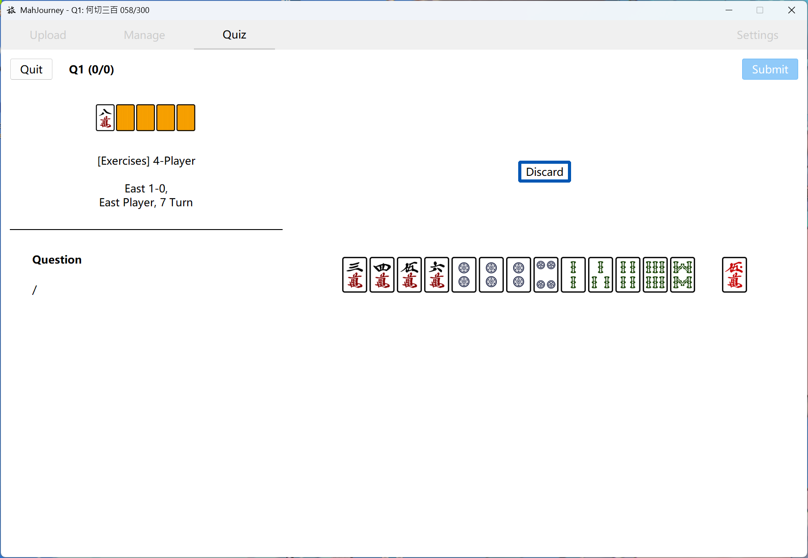
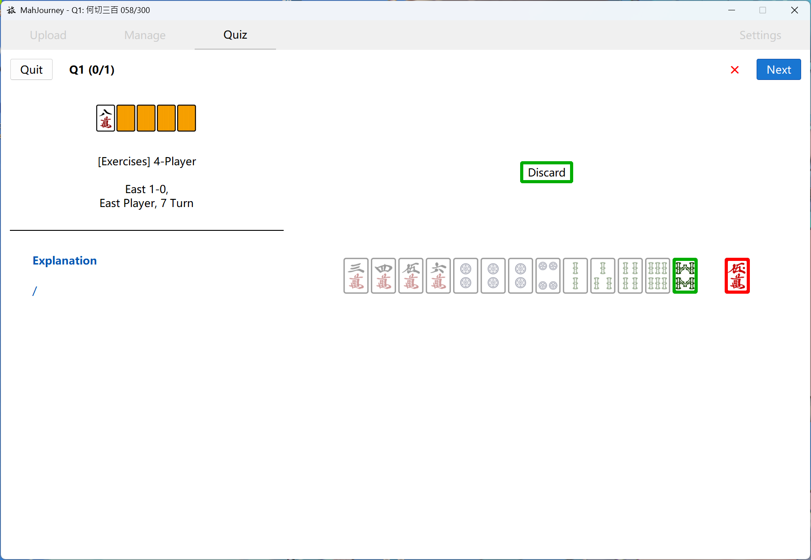
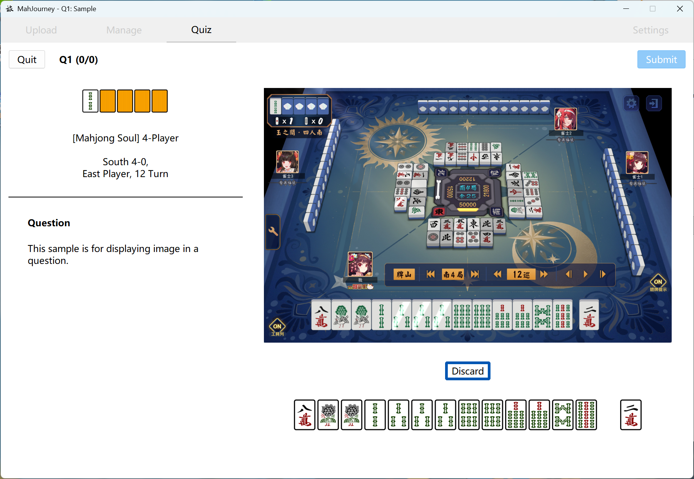
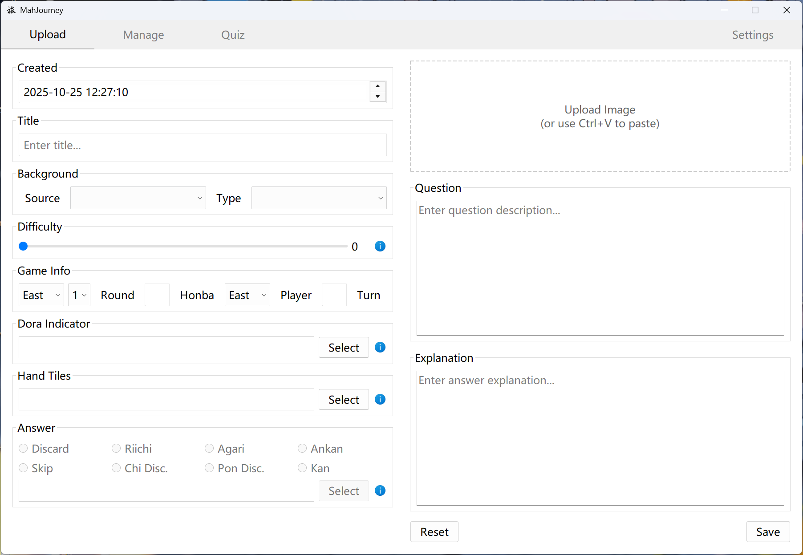
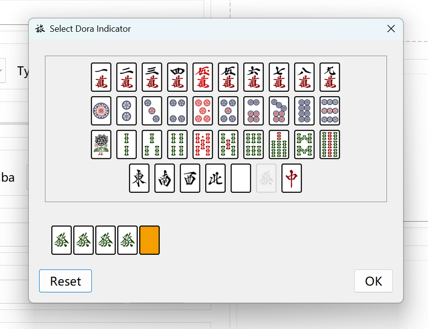
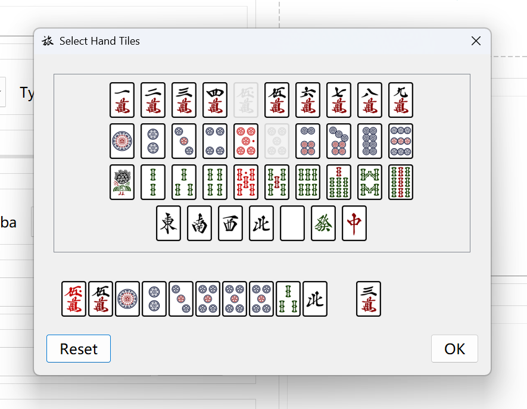
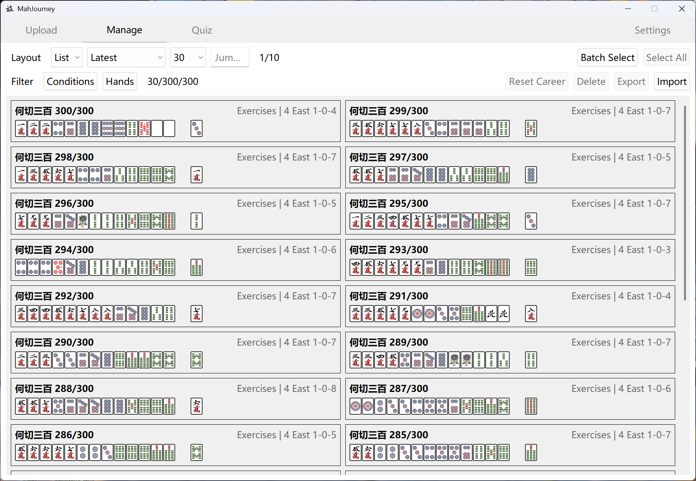
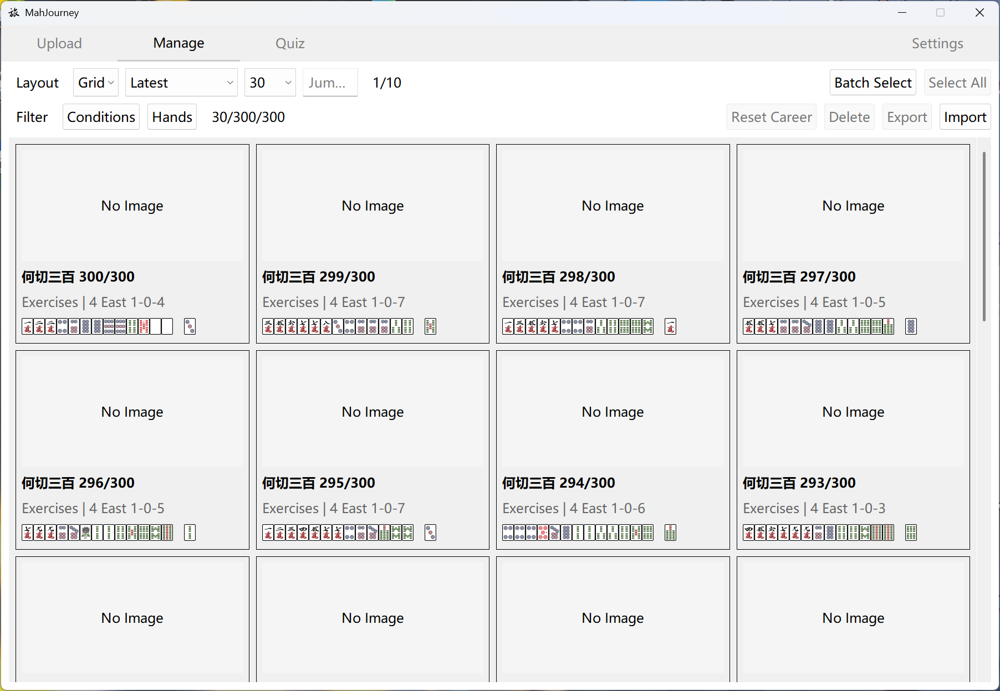
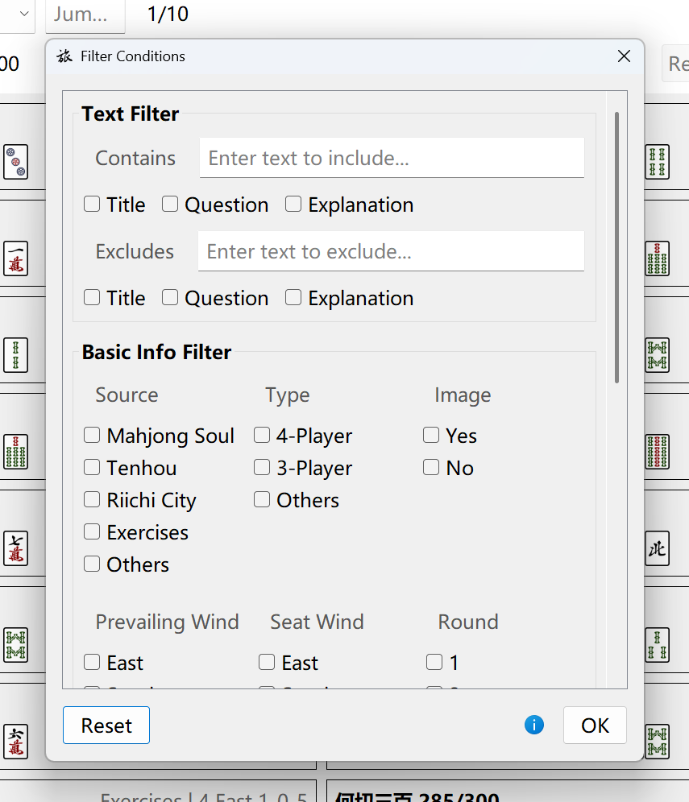

# MahJourney 何切之旅

[ [Eng](README.md) | [简中](others/READMEs/README-SC.md) | [繁中](others/READMEs/README-TC.md) | [日本語](others/READMEs/README-JP.md) ]

A tool for Riichi Mahjong discard training. You can upload custom discard problems with images; manage problem sets, import or export problem collections; and practice discards after selecting modes or filtering problems. It can also be used simply as a collection and appreciation tool for gathering complex board state discards you have encountered.

Wish you continuous improvement in your Mahjong skills.

## :sparkles:Features

### Practice!

Practice makes perfect.

   
  

 

On the practice page, filter the desired problems and modes, then start answering. Select your discard action and tile, then submit.

You can immediately see the pre-set answers (correct/incorrect indicated by green/red borders), and the "Problem Description" on the left sidebar will change to show "Explanation".

   

 

Also supports problems with images. Suitable for complex situations involving call judgments, point calculations, and deal-in avoidance decisions. Note that the images themselves are not clickable.

---

### Upload Problem

   

 

The initial page for uploading problems. Here you can:
- Fill in basic information like title, background, and game info.
- Write the problem intro and explanation.
- (Optional) Upload or paste an image.
- (Optional) Set a custom difficulty level for future reference and filtering.
  - Default is 0. If set to 0, the difficulty will not be displayed in the practice interface or problem bank.

   
  

 

- Select Dora indicators, hand tiles, answer action, and answer tile.

---

### Manage Problems

   

 

   

 

The management page. Here you can:
- Browse your problem bank in list or grid view.
- Select a specific problem to modify it or view its practice statistics.
- Batch select multiple problems for operations like deletion or export.
  - Export packages the corresponding data and images into a .zip file, saved to `.../saves/export/`. You can use this for backups.
  - Deletion cannot be undone.
- Import problems.
  - Generally only accepts .zip files generated by the export function.

   

 

- Use condition filters or hand tile filters to browse only problems that meet specific criteria.

## :package:Download

v0.9.0 [Releases](https://github.com/AokoC/MahJourney/releases)

## :construction:Planned Features

Listed from more likely to less likely:

- [ ] Improve translations and fix errors in various language versions.
- [ ] Add a stats page to view special data, like total attempts, total time spent, etc.
- [ ] Web version.
- [ ] Automated analysis of tile counts and waiting tiles, eliminating the need to manually write related explanations.
- [ ] Mobile app version.
- [ ] Image recognition for automatic hand tile input.

This project was initially created to fulfill my personal needs, so it's unlikely I will implement most of the above features... PRs are welcome if you are interested.

## :question:FAQ

### What's the "300 Problems" in your screenshot?

> I created that set myself. You can also find it in [Releases](https://github.com/AokoC/MahJourney/releases), named `300.zip`. Import this file in the management interface. Think of it as an optional built-in problem bank.
>
> Note that this problem set only contains the problems themselves, without explanations, and there might be errors due to manual entry. Some answers have been adjusted according to Naga's suggestions or include multiple correct answers. Please refer to the original "300 Problems" book and [this Bilibili column](https://www.bilibili.com/read/readlist/rl865145) for details.

> Uploading a large number of problems at once can be very labor-intensive. If you need to do bulk uploads (e.g., for other problem books):
>
> Please refer to [this file](others/batch-upload/batch.py). This script can help you convert a large number of .txt format problems (separated by newlines) into the data.json format used by this software. However, you still need to create the .txt files manually (and I forgot to make it require a .zip for import, so you might need to compress it manually afterwards).

### Can I change the tile faces?

> Certainly. Open `.../_internal/src/assets/tiles` - that's where the tile face resources are stored. You can freely replace them as long as you keep the filename, format, and dimensions (70*100) the same.

### Some text appears cramped or overlapping when I open the software.

> Try resizing the window, or adjust the font size until it looks right. Then restart the software.