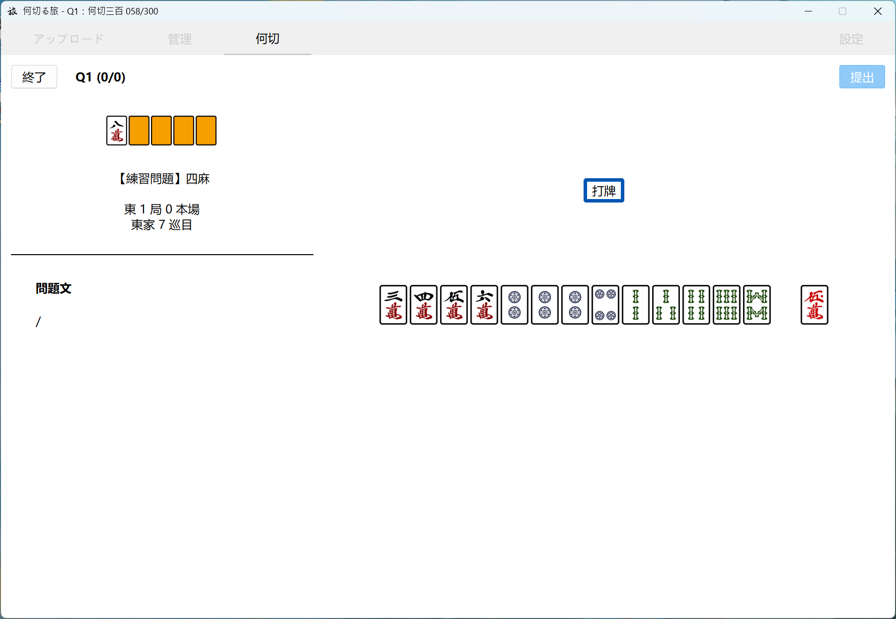
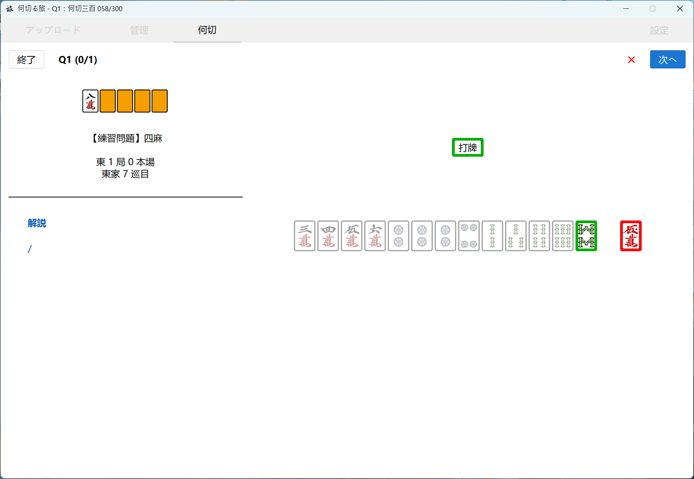
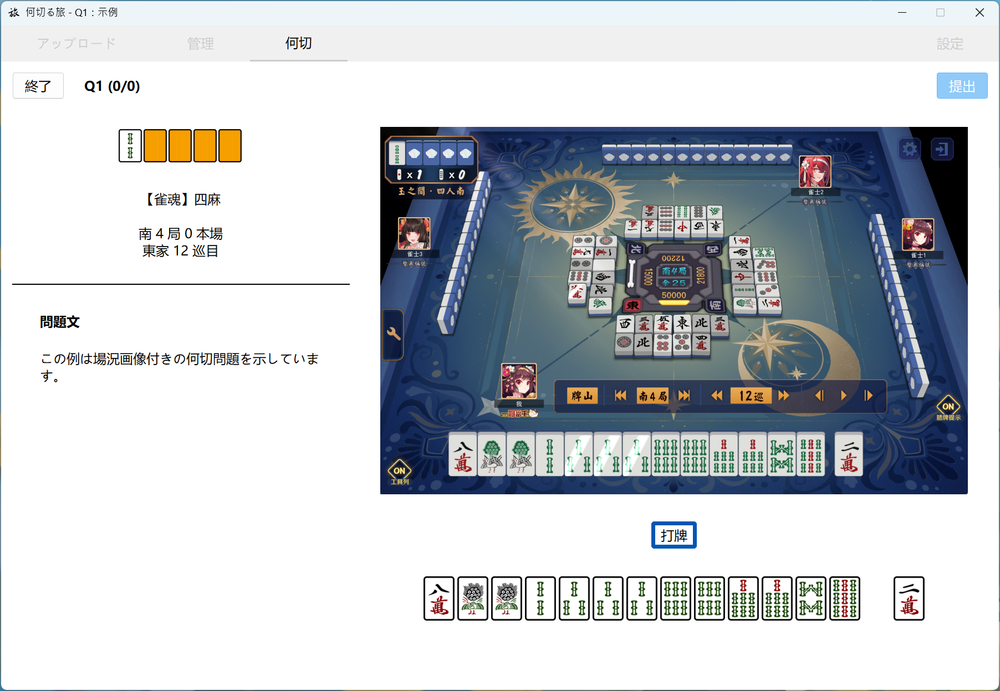
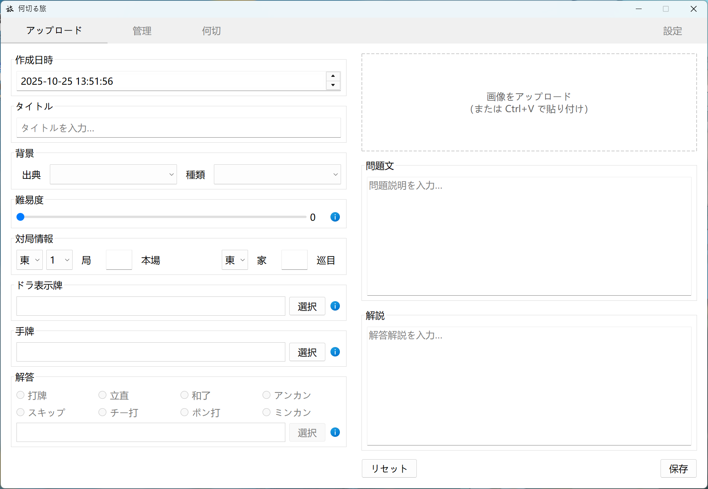
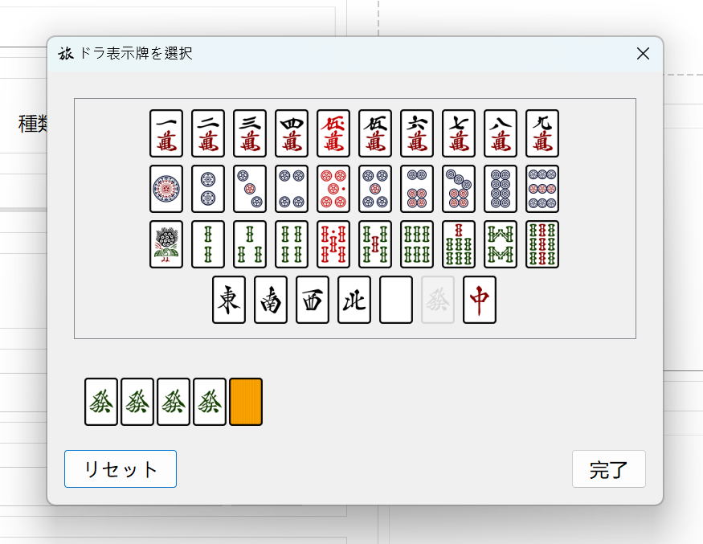
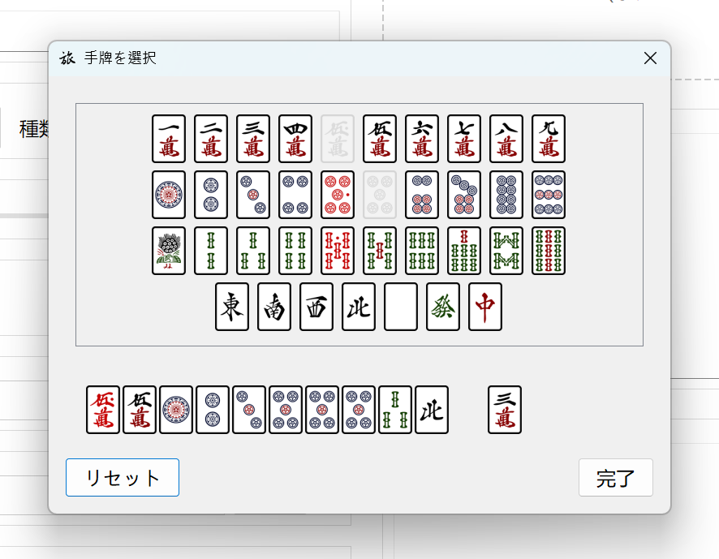
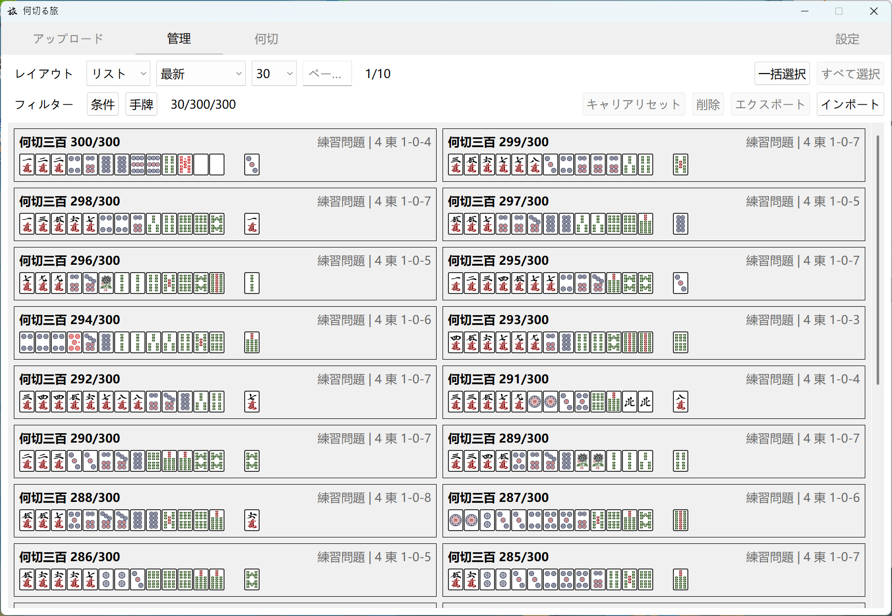
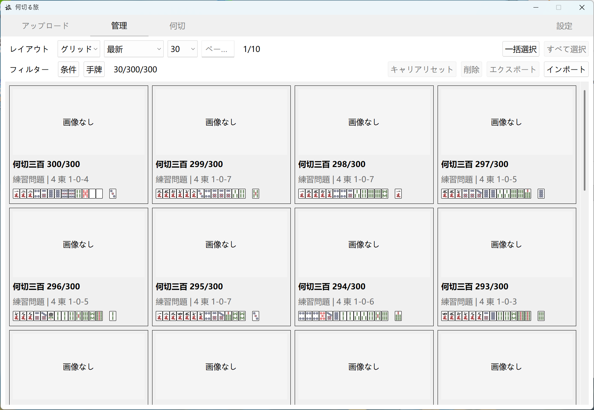
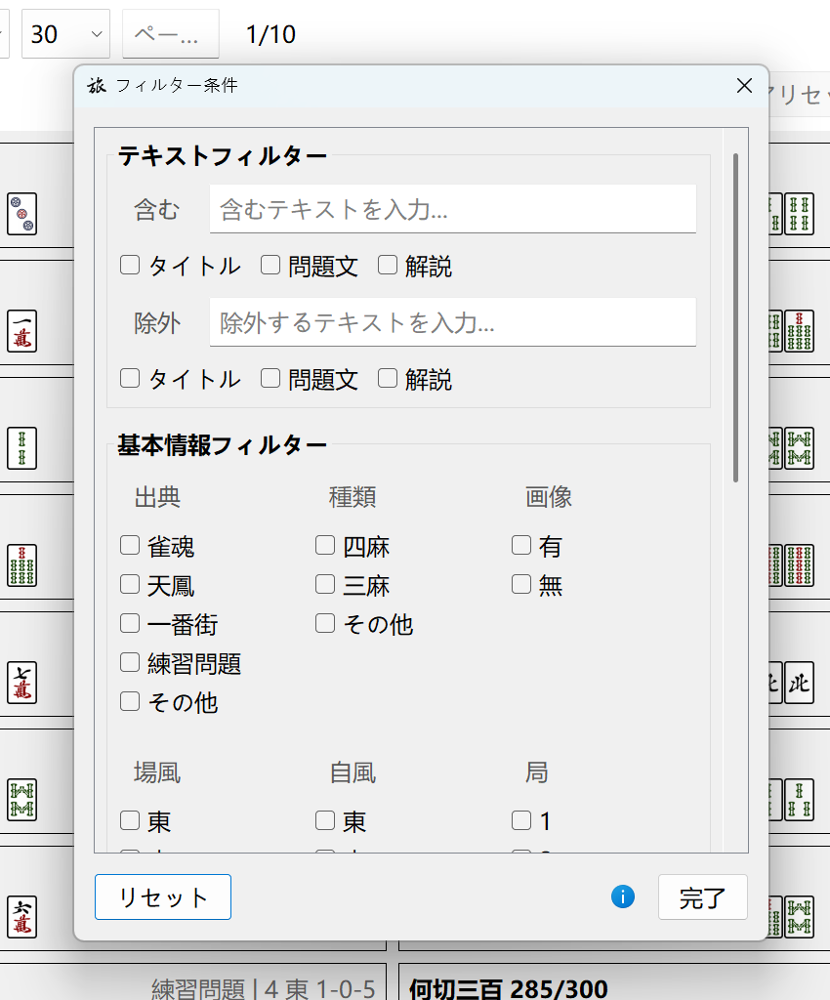

# MahJourney 何切る旅

[ [Eng](../../README.md) | [简中](README-TC.md) | [繁中](README-TC.md) | [日本語](README-JP.md) ]

立直麻雀の「何切る」練習用ツールです。画像付きのカスタム問題をアップロードしたり、問題集の管理やインポート/エクスポートが可能です。モード選択や問題フィルター後に練習できます。遭遇した複雑な場面を収集・鑑賞するコレクションツールとしても利用できます。

雀力アップを目指しましょう。

## :sparkles:機能

### 練習！

とにかく、練習あるのみ。

   
  

 

何切るページで、希望の問題とモードをフィルタリングして解答を開始します。解答アクションと牌を選択し、提交します。

アップロード時に設定された答え（正誤は緑/赤の枠線で区別）が即座に表示され、左側サイドバーの【問題文】が【解説】に変わります。

   

 

画像付きの問題にも対応しています。

鳴き判断や点数計算、振り込み回避に関する複雑な場面の分析に適しています。画像自体はクリックできません。

---

### 問題をアップロード

   

 

問題をアップロードする初期ページです。ここでは以下のことができます：
- 問題のタイトル、背景、対局情報などの基本情報を入力
- 問題文と解説を記入
- （任意）画像をアップロードまたは貼り付け
- （任意）今後の参照およびフィルタリングのために問題の難易度をカスタマイズ
  - デフォルトは 0 です。0 の場合、後続の練習インターフェースと問題バンクにはこの問題の難易度は表示されません

   
  

 

- ドラ表示牌、手牌、解答アクション、解答牌を選択

---

### 問題の管理

   

 

   

 

管理ページです。ここでは以下のことができます：
- リストまたはグリッド形式で問題バンクを閲覧
- 特定の問題を選択して変更したり、その練習統計データを閲覧
- 複数の問題を一括選択して、削除やエクスポートなどの操作を実行
  - エクスポート操作は対応するデータと画像を .zip 形式にパッケージ化し、`.../saves/export/` フォルダに保存します。必要に応じて、エクスポートでバックアップできます
  - 削除操作は元に戻せません
- 問題をインポート
  - 通常、エクスポートによって生成された .zip ファイルのみを受け入れます

   

 

- 条件フィルタリングや手牌フィルタリングを使用して、条件に合った問題のみを閲覧

## :package:ダウンロード

v0.9.0 [リリース](https://github.com/AokoC/MahJourney/releases)

## :construction:計画中の機能

実現可能性の高い順から低い順に：

- [ ] 各言語での誤訳、不適切な翻訳の改善と更新
- [ ] 統計ページを新設し、総解答数、総所要時間などの特殊なデータを表示
- [ ] Web 版
- [ ] 枚数、進張数などの分析機能。関連する解説を手動で記入する必要がなくなります
- [ ] モバイルアプリ版
- [ ] 画像認識による手牌の自動入力

このプロジェクトは元々自身の必要性を満たすために作られたため、これらの項目のほとんどが実装される可能性は高くありません……興味があれば PR を歓迎します。

## :question:よくある質問

### スクリーンショットにある「何切三百」とは？

> これは自分で入力した問題集です。[リリース](https://github.com/AokoC/MahJourney/releases) から `300.zip` という名前で見つけることができます。管理画面でこのファイルをインポートしてください。オプションの内蔵問題バンクとしてお考えください。
>
> この問題集には問題のみが含まれており、解説はなく、手入力による誤りがある可能性があることに注意してください。一部の答えは Naga の手法に変更されたもの、または複数の答えがあるものがあります。詳細は原書の「何切る 300」および[この Bilibili のコラム](https://www.bilibili.com/read/readlist/rl865145)を参照してください。

> 一度に大量の問題をアップロードするのは非常に労力がかかります。もし他の問題集などで一括アップロードが必要な場合は：
>
> [このファイル](../batch-upload/batch.py) を参照してください。このプログラムは、改行で区切られた大量の .txt 形式の問題を、本ソフトウェアの data.json 形式に変換するのに役立ちます。ただし、.txt ファイルは依然として自分で入力する必要があります（そしてインポートには .zip が必要なことを忘れていたので、その後手動で圧縮する必要があるかもしれません）。

### 牌のデザインは変更できますか？

> もちろんできます。`.../_internal/src/assets/tiles` を開いてください。そこに牌の画像リソースがあります。ファイル名、形式名、画像サイズ（70*100）を維持すれば、自由に置き換えることができます。

### ソフトウェアを開くと、一部の文字が重なって表示されます

> ウィンドウのサイズを変更するか、フォントサイズを適切に見えるように調整してみてください。その後、ソフトウェアを再起動してください。