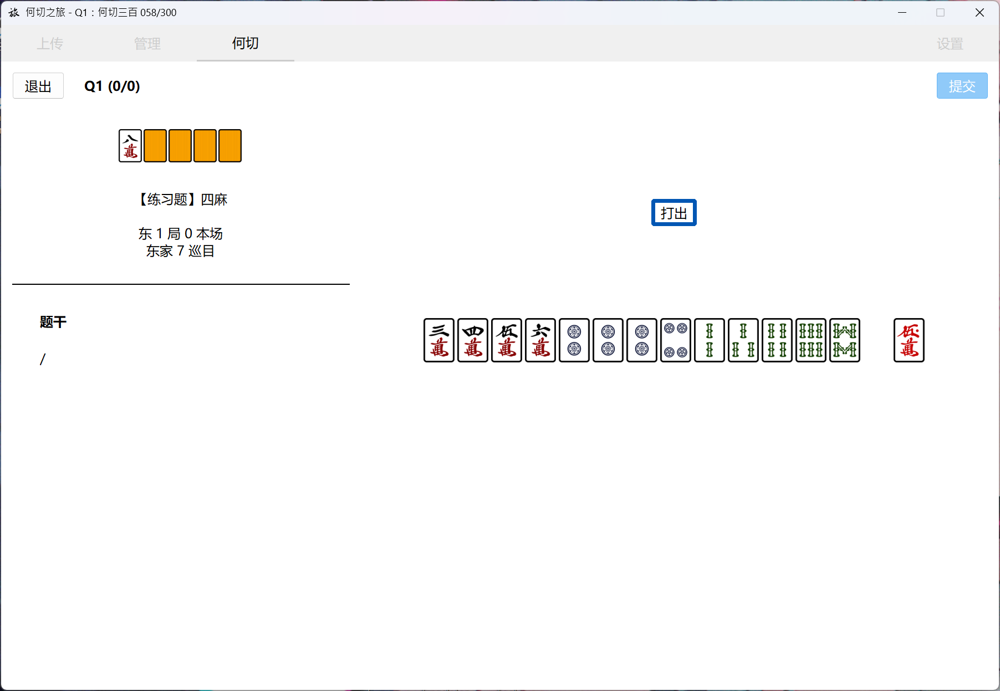
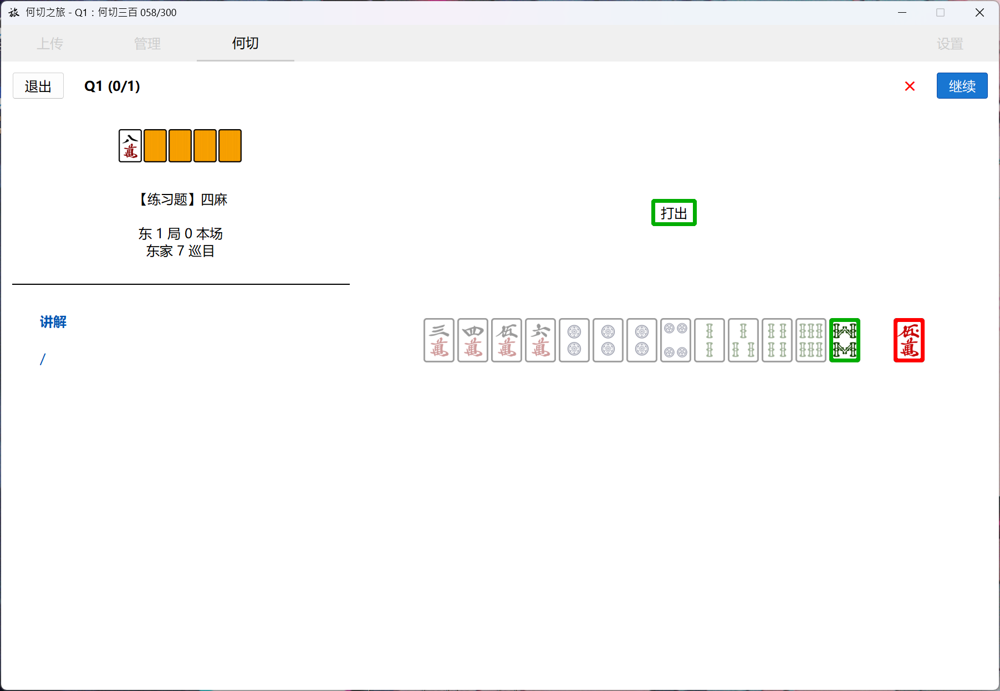
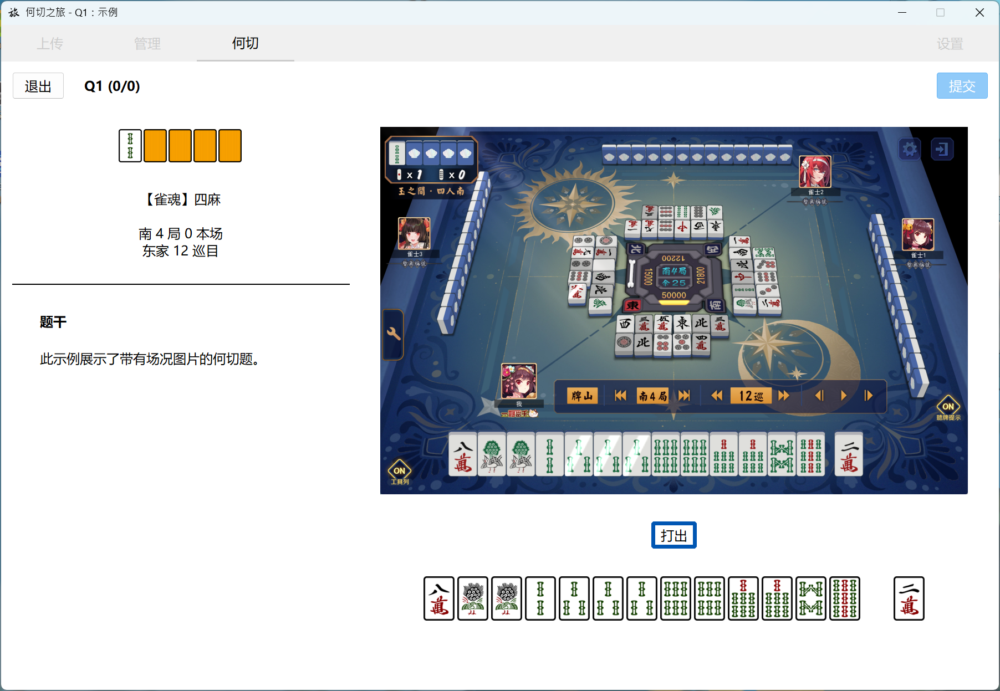
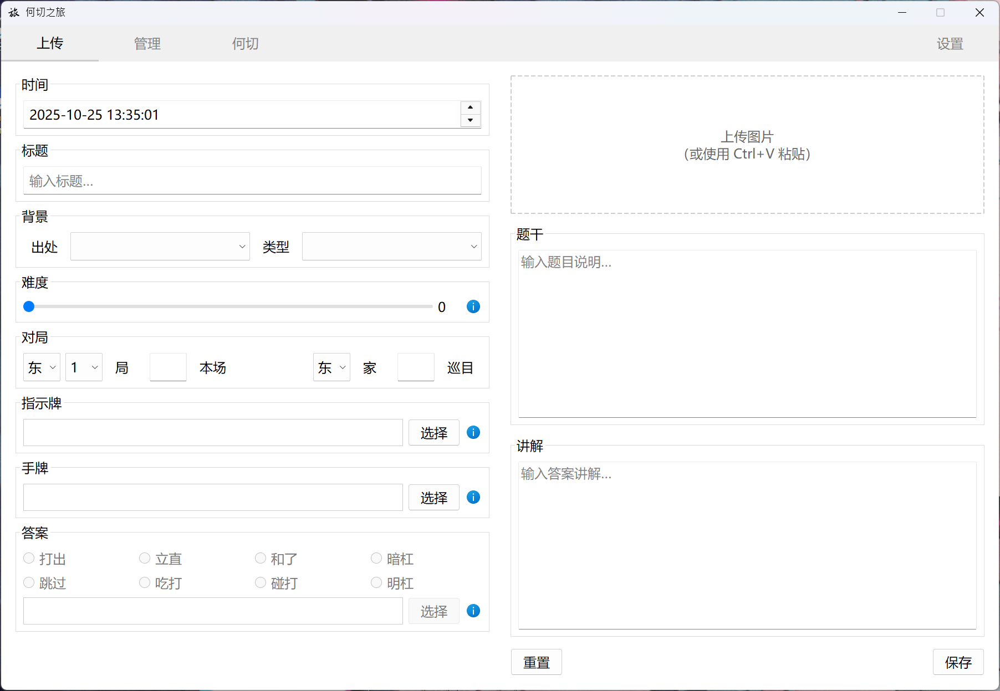
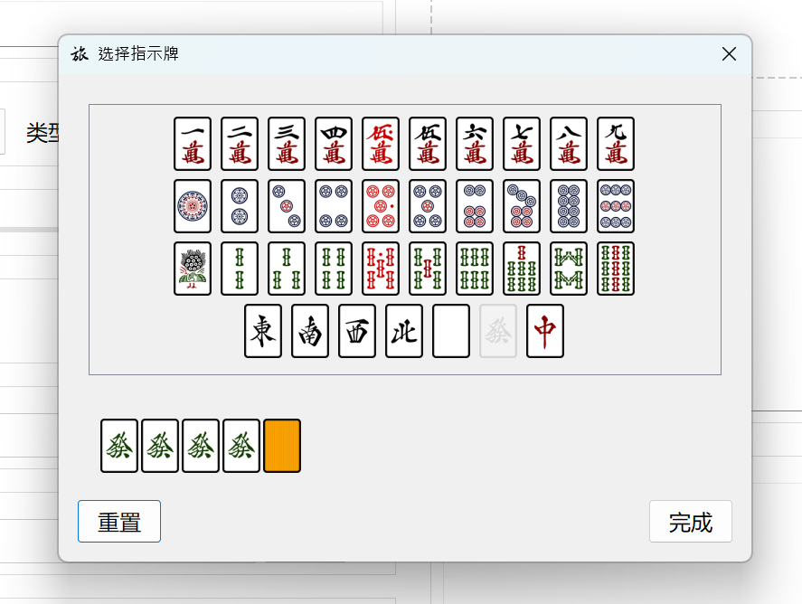
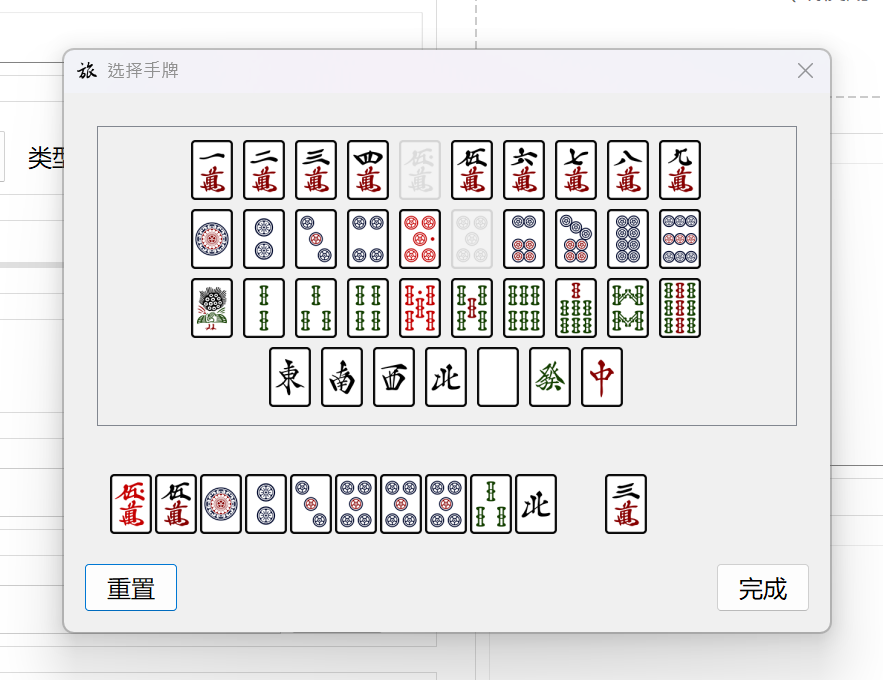
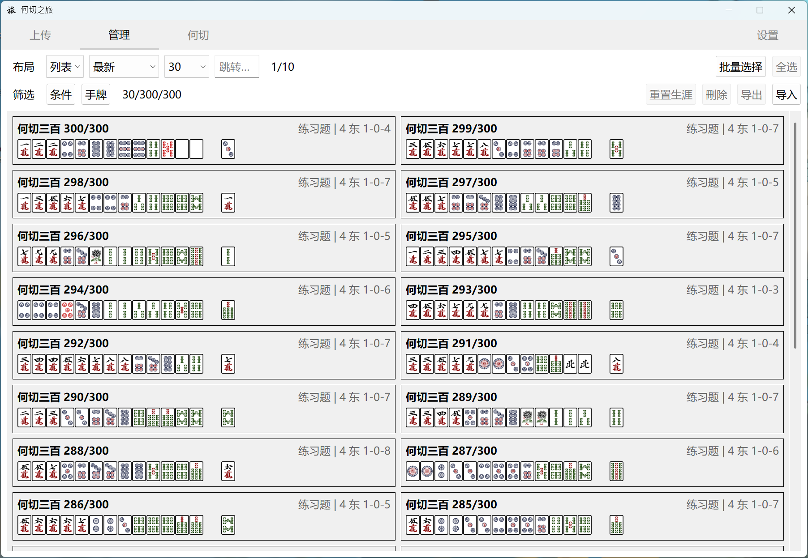
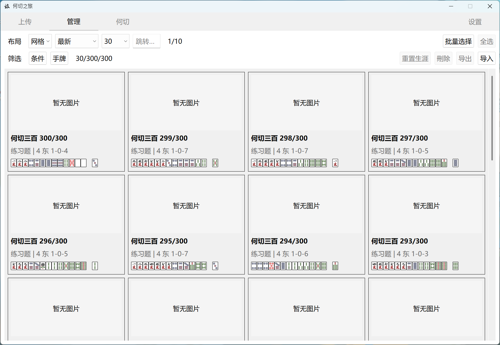
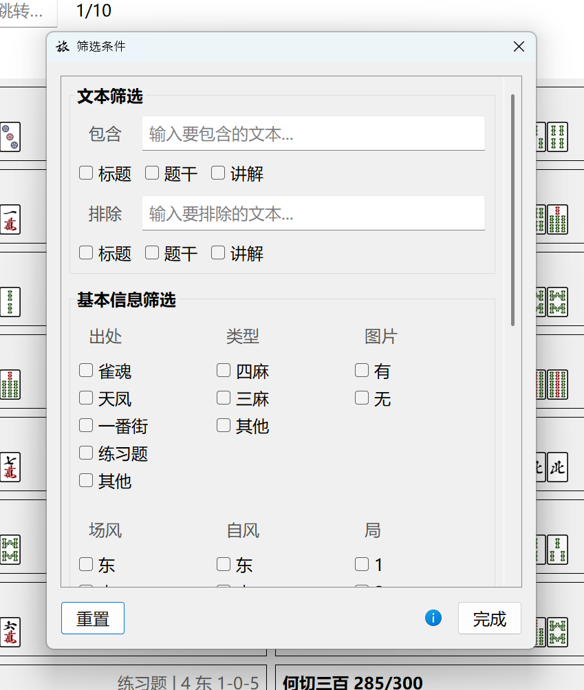

# MahJourney 何切之旅

[ [Eng](../../README.md) | [简中](README-SC.md) | [繁中](README-TC.md) | [日本語](README-JP.md) ]

用于立直麻将何切训练的工具。你可以上传带有图片的自定义何切；管理题库、导入或导出何切集；以及在选择模式或筛选题目后，进行何切练习。甚至单纯当成一个收藏鉴赏工具，用于收集自己遇到过的复杂场况何切，也是可以的。

祝雀力日进。

## 功能

### 刷题！

那还说什么呢，刷题就完事了。

   
  

 

在何切页面，筛选想要的何切和模式并开始答题后，选择答案动作、答案牌并提交。

可以即时看到先前上传时设置好的答案（对错由红绿色的框线区分），并且左侧栏的【题干】会变成【讲解】。

   

 

也支持带有图片的何切。

很适合那些有着复杂场况、需要做鸣牌判断，甚至是算点和见逃相关的何切。不过图片本身是不支持点击的。

---

### 上传何切

   

 

初始页面，用以上传何切。在此处可以：
- 填写何切的标题、背景、对局等基础信息
- 填写题干和讲解
- （可选）上传或粘贴图片
- （可选）自定义何切的难度，供日后参考以及筛选
  - 默认为 0，如果为 0 的话则后续在答题界面以及题库里不会显示该何切的难度

   
  

 

- 选择指示牌、手牌、答案行动、答案牌

---

### 管理何切

   

 

   

 

管理页面。在此处可以：
- 以列表或网格形式浏览何切题库
- 选中某道何切，修改，或观看其生涯数据
- 批量选中多道何切，进行删除、导出等操作
  - 导出操作会将对应的数据和图片打包成 `.zip`，保存至 `.../saves/export/` 文件夹。如有需要，可以用导出备份
  - 删除操作将无法恢复
- 导入何切
  - 一般只接受导出产生的 `.zip`

   

 

- 使用条件筛选或手牌筛选，只浏览符合条件的何切

## 待实现

从可能到不可能排列：

- [ ] 各语言的错译、差译优化更新
- [ ] 新增生涯页面，可以查看一些特殊的数据，例如总作答数，总时长之类
- [ ] 网页版本
- [ ] 枚数、进张数等分析，无需再手动填写相关讲解
- [ ] 手机应用版本
- [ ] 图像识别，无需再手动选择手牌

这个项目最初是为了满足我自身需求而做的，因此大概率不会再实装以上这些项目了，仅仅是列出曾想过的功能……如果你有兴趣的话，欢迎 PR。

## 下载

v0.9.1 [Releases](https://github.com/AokoC/MahJourney/releases)

v0.9.1 [微云]()

## 我有问题！

### 为什么你图片里有个何切三百？

> 这是我自己敲的。你可以同样在 [Releases](https://github.com/AokoC/MahJourney/releases) 找到它，名为 `300.zip`；到管理界面导入该文件即可。就当是一个可选的内置题库。
>
> 值得注意的是，该何切集只有题目，并无讲解，且由于是人手敲的可能会有错漏。当中的部分答案改成了 Naga 的切法，或是多个答案。具体请参考何切 300 原书，以及[这个 b 站专栏](https://www.bilibili.com/read/readlist/rl865145)。

> 一次性上传大量的何切会非常耗费精力。如果你也需要大量上传的话（例如其他何切书籍）：
>
> 请参考[这个文件](../batch-upload/batch.py)，该程序可以帮助你将大量的 `.txt` 格式的、换行区分的何切，转换成本软件的 `data.json` 格式。只不过 `.txt` 还是得自己敲（而且我忘记了要做成 `.zip` 才能导入，所以你可能还得手动压缩下）。

### 可以更换牌面吗？

> 当然可以。打开 `.../_internal/src/assets/tiles`，里面就是牌面素材。只要你保持文件名、格式名、素材尺寸（70*100），可以随意替换。

### 我打开软件后有些字挤在一起了

> 尝试拉伸窗口，或者修改字体尺寸直到合适。然后重启软件。