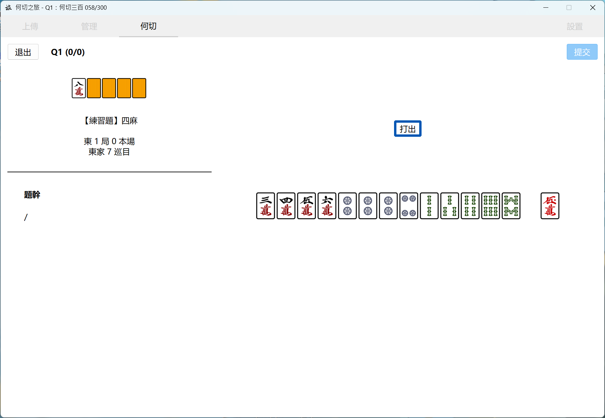
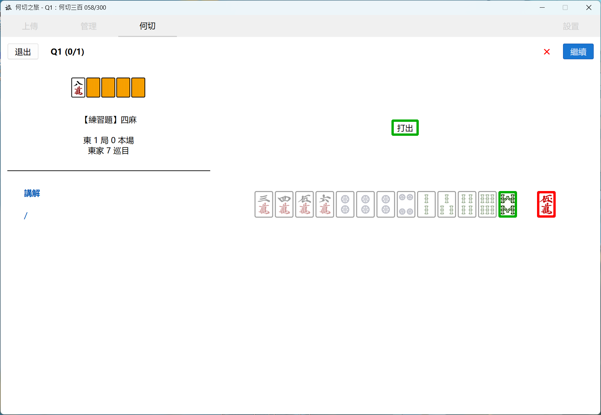
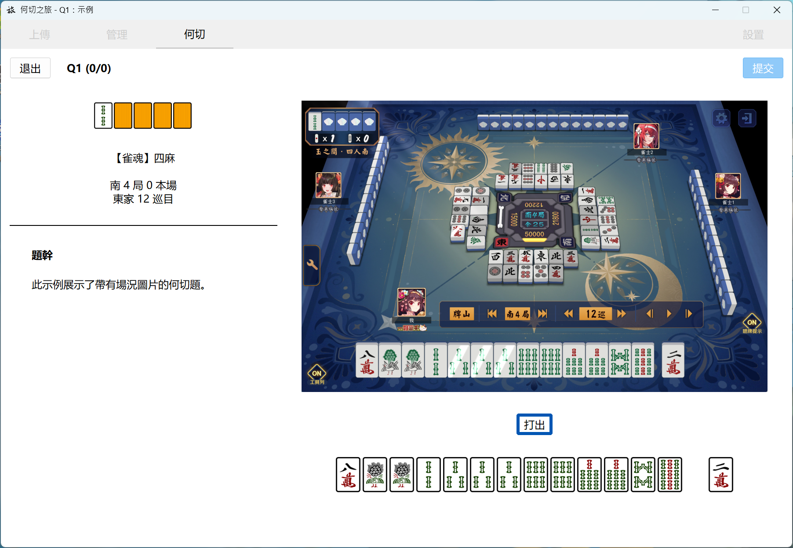
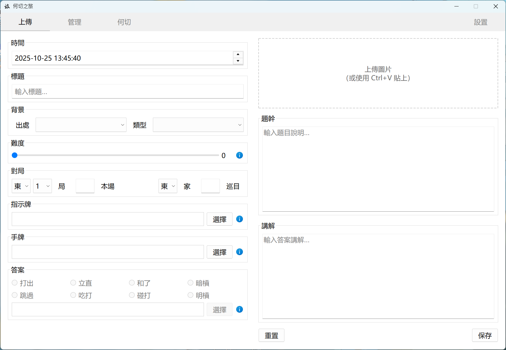
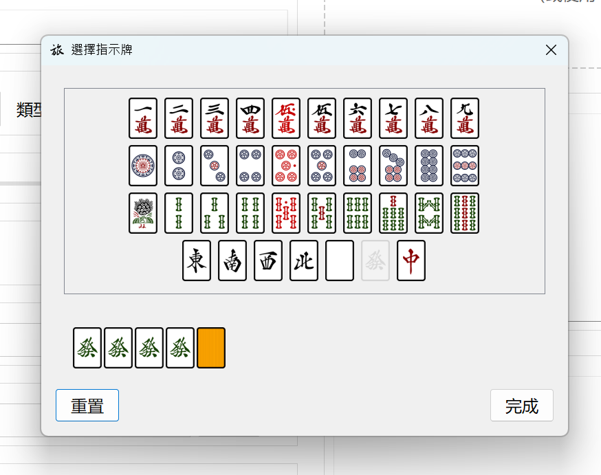
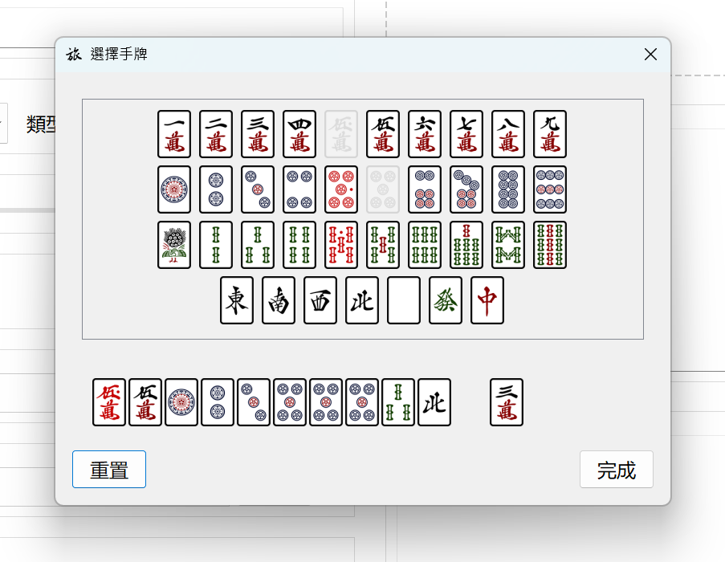
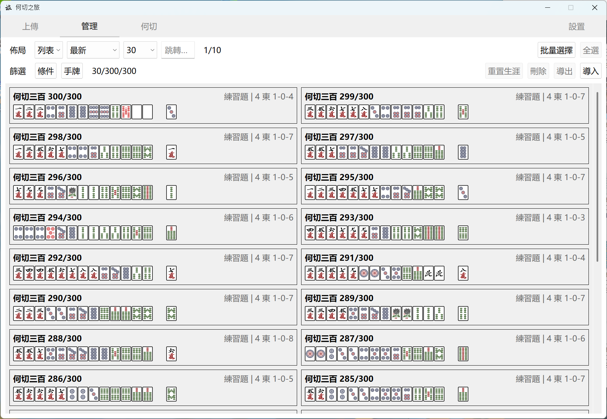
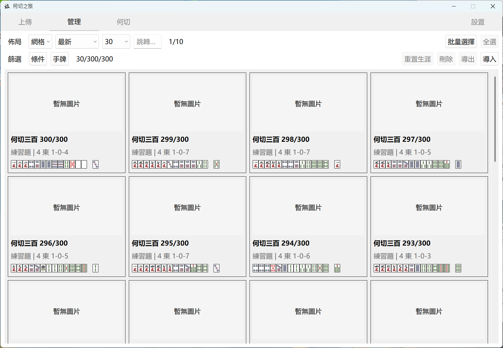
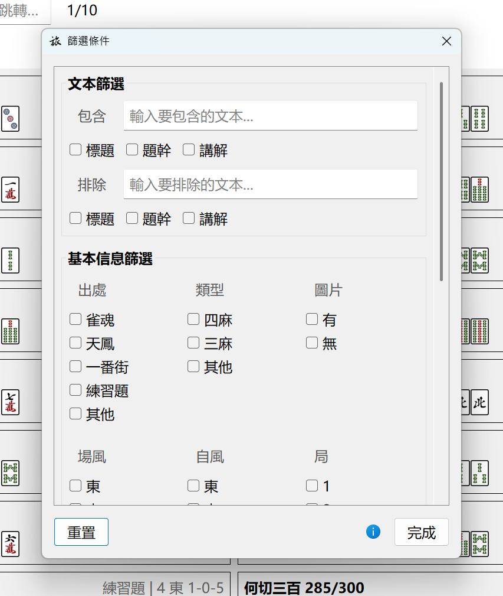

# MahJourney 何切之旅

[ [Eng](../../README.md) | [简中](README-TC.md) | [繁中](README-TC.md) | [日本語](README-JP.md) ]

用於立直麻將何切訓練的工具。你可以上傳帶有圖片的自定義何切；管理題庫、導入或導出何切集；以及在選擇模式或篩選題目後，進行何切練習。甚至單純當成一個收藏鑑賞工具，用於收集自己遇到過的複雜場況何切，也是可以的。

祝雀力日進。

## :sparkles:功能

### 刷題！

那還説甚麼呢，刷題就完事了。

   
  

 

在何切頁面，篩選想要的何切和模式並開始答題後，選擇答案動作、答案牌並提交。

可以即時看到先前上傳時設置好的答案（對錯由紅綠色的框線區分），並且左側欄的【題幹】會變成【講解】。

   

 

也支持帶有圖片的何切。

很適合那些有著複雜場況、需要做鳴牌判斷，甚至是算點和見逃相關的何切。不過圖片本身是不支持點擊的。

---

### 上傳何切

   

 

初始頁面，用以上傳何切。在此處可以：
- 填寫何切的標題、背景、對局等基礎信息
- 填寫題幹和講解
- （可選）上傳或貼上圖片
- （可選）自定義何切的難度，供日後參考以及篩選
  - 默認為 0，如果為 0 的話則後續在答題界面以及題庫里不會顯示該何切的難度

   
  

 

- 選擇指示牌、手牌、答案行動、答案牌

---

### 管理何切

   

 

   

 

管理頁面。在此處可以：
- 以列表或網格形式瀏覽何切題庫
- 選中某道何切，修改，或觀看其生涯數據
- 批量選中多道何切，進行刪除、導出等操作
  - 導出操作會將對應的數據和圖片打包成 .zip，保存至 `.../saves/export/` 文件夾。如有需要，可以用導出備份
  - 刪除操作將無法恢覆
- 導入何切
  - 一般只接受導出產生的 .zip

   

 

- 使用條件篩選或手牌篩選，只瀏覽符合條件的何切

## :package:下載

v0.9.0 [Releases](https://github.com/AokoC/MahJourney/releases)

## :construction:待實現

從可能到不可能排列：

- [ ] 各語言的錯譯、差譯優化更新
- [ ] 新增生涯頁面，可以查看一些特殊的數據，例如總作答數，總時長之類
- [ ] 網頁版本
- [ ] 枚數、進張數等分析，無需再手動填寫相關講解
- [ ] 手機應用版本
- [ ] 圖像識別，無需再手動選擇手牌

這個項目最初是為了滿足我自身需求而做的，因此大概率不會再實裝以上這些項目了，僅僅是列出曾想過的功能……如果你有興趣的話，歡迎 PR。

## :question:我有問題！

### 為甚麼你圖片里有個何切三百？

> 這是我自己敲的。你可以同樣在 [Releases](https://github.com/AokoC/MahJourney/releases) 找到它，名為 `300.zip`；到管理界面導入該文件即可。就當是一個可選的內置題庫。
>
> 值得注意的是，該何切集只有題目，並無講解，且由於是人手敲的可能會有錯漏。當中的部分答案改成了 Naga 的切法，或是多個答案。具體請參考何切 300 原書，以及[這個 b 站專欄](https://www.bilibili.com/read/readlist/rl865145)。

> 一次性上傳大量的何切會非常耗費精力。如果你也需要大量上傳的話（例如其他何切書籍）：
>
> 請參考[這個文件](../batch-upload/batch.py)，該程序可以幫助你將大量的 .txt 格式的、換行區分的何切，轉換成本軟件的 data.json 格式。只不過 .txt 還是得自己敲（而且我忘記了要做成 .zip 才能導入，所以你可能還得手動壓縮下）。

### 可以更換牌面嗎？

> 當然可以。打開 `.../_internal/src/assets/tiles`，裏面就是牌面素材。只要你保持文件名、格式名、素材尺寸（70*100），可以隨意替換。

### 我打開軟件後有些字擠在一起了

> 嘗試拉伸窗口，或者修改字體尺寸直到合適。然後重啟軟件。